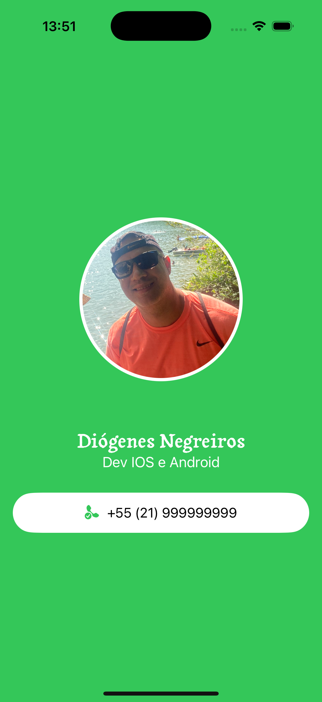

# Cartão de Visita - App Simples

Este é um aplicativo básico que exibe um cartão de visita digital com foto, nome e número de telefone. Ideal para aprender conceitos iniciais de layout, componentes visuais e estrutura de um app com swiftUI.

## ✨ Funcionalidades

- Exibe uma foto de perfil
- Mostra nome e cargo
- Apresenta número de telefone para contato
- Layout simples com SwiftUI

## 🖼️ Captura de Tela




## 🚀 Como rodar o projeto

1. Clone o repositório:

```bash
git clone https://github.com/diogenesNegreiros/MeuProjetoSwiftUI.git
cd seu-repositorio
